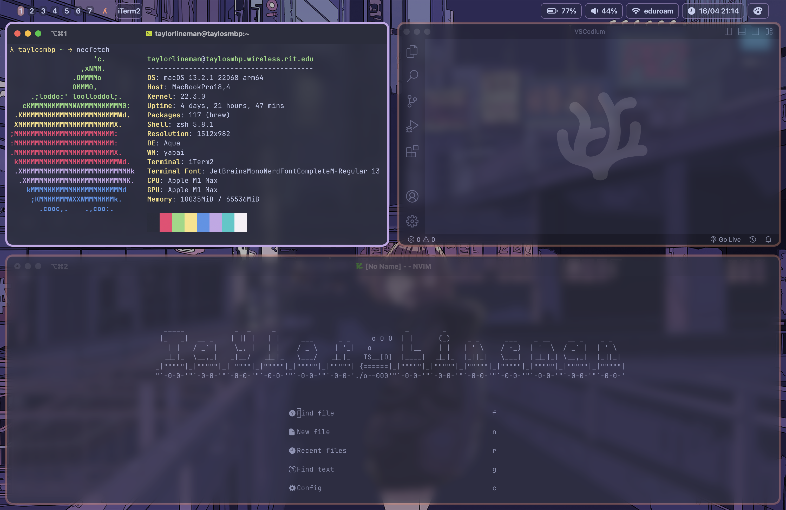

# .dotfiles
These the dotfiles that I use in daily life on macOS and sometimes on linux!

## MacOS
On macOS I use the [yabai](https://github.com/koekeishiya/yabai) window manager for keyboard based navigation throughout my space and windows. For code editors I use [VSCodium](https://github.com/VSCodium/vscodium), [CLion](https://www.jetbrains.com/clion/) and [NeoVim](https://neovim.io).

I also have a script that sits in my custom menu bar that will set the theme depending on the macOS appearance mode.

### MacOS Light Mode

### MacOS Dark Mode

## What terminal do I use?
I use [iTerm2](https://iterm2.com/)! It has been really nice to use, and I have been using it for a long time at this point. I would highly recommned checking it out.

# Credits
A lot of the nvim setup was taken from [lazy.nvim](https://www.lazyvim.org/). It is a super good setup to get started with and I would totally recommend it to anyone new like me.
